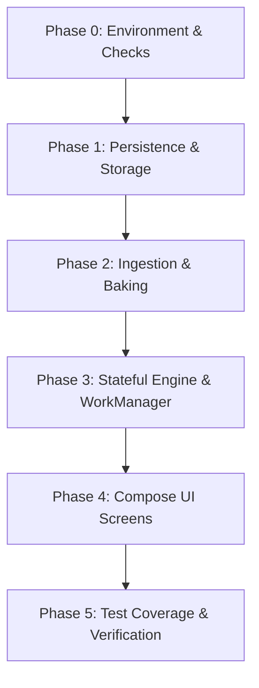

# Sprint Plan: Scheduled Custom Wallpaper Android Application

This document outlines the phased development roadmap and checklist for implementing the scheduled custom wallpaper Android utility. It details all engineering tasks required across persistence, ingestion/baking pipelines, stateful evaluation engine, WorkManager scheduler, Compose UI, and test coverage.

All package references and namespaces are aligned with the `com.example.customwallpaper` package namespace.

---

## Phased Checklist Roadmap

---

## Phase 0: Development Environment & Pre-commit Check Setup

Setup base workspace configuration, multi-module project Gradle dependencies, linting configurations, emulator setup, and a pre-commit verification pipeline.

### Core Android Toolchain Concepts

- **Gradle**: The build system compiling Kotlin code and packaging it into an Android APK. It manages dependencies, compiling, testing, and packaging tasks.
- **Android SDK**: The software development kit containing libraries, compilers, and APIs required to build Android applications for target Android platform versions.

- [ ] **Task 0.1: Development Environment Setup & Validation Script**
  - **Target files:** 
    - `validate_env.sh`
    - `.git/hooks/pre-commit`
  - **Prerequisites:** None.
  - **Verification:** Run './validate_env.sh' at the project root on Ubuntu Linux. The script must successfully check Java JDK 17, KVM virtualization status, /dev/kvm access permissions, snap Android Studio setup, ANDROID_HOME path configuration, and confirm the executable Git pre-commit lint check hook is present.

- [ ] **Task 0.2: Project-level Gradle Configuration**
  - **Target files:** 
    - `/home/philong/wallpaper-scheduler/build.gradle.kts`
    - `/home/philong/wallpaper-scheduler/settings.gradle.kts`
  - **Prerequisites:** Task 0.1.
  - **Verification:** Run './gradlew projects' to verify the project successfully parses root configurations and registers the ':app' module.

- [ ] **Task 0.3: App-level Gradle Configuration & Dependency Declaration**
  - **Target files:** 
    - `/home/philong/wallpaper-scheduler/app/build.gradle.kts`
  - **Prerequisites:** Task 0.2.
  - **Verification:** Run './gradlew assembleDebug' to confirm all target libraries (Room, WorkManager, Coil, Compose) compile successfully.

- [ ] **Task 0.4: Manifest Permissions and Runtime Receiver Configurations**
  - **Target files:** 
    - `/home/philong/wallpaper-scheduler/app/src/main/AndroidManifest.xml`
  - **Prerequisites:** Task 0.3.
  - **Verification:** Verify compilation completes and AndroidManifest.xml declares permissions (SET_WALLPAPER, RECEIVE_BOOT_COMPLETED), CustomWallpaperApplication class, and static BootCompletedReceiver.

---

## Phase 1: Persistence & Storage Foundation

Construct the Room SQLite database, data schemas, DAOs, and reference-counted file management cleanup logic.

- [ ] **Task 1.1: Room Database Schedule Entity Definition**
  - **Target files:** 
    - `/home/philong/wallpaper-scheduler/app/src/main/java/com/example/customwallpaper/wallpaperscheduler/data/WallpaperSchedule.kt`
  - **Prerequisites:** Task 0.3.
  - **Verification:** Verify compilation of entity properties matches:
    - Table name `schedules`.
    - Fields: `id` (Long, PK auto-increment), `weekdays` (String), `fromTimeMin` (Int), `toTimeMin` (Int), `priority` (Int), `homeWallpaperPath` (String?), `lockWallpaperPath` (String?), `isActive` (Boolean).
    - Namespace is `com.example.customwallpaper.wallpaperscheduler.data`.

- [ ] **Task 1.2: Room Data Access Object (DAO) Interface**
  - **Target files:** 
    - `/home/philong/wallpaper-scheduler/app/src/main/java/com/example/customwallpaper/wallpaperscheduler/data/ScheduleDao.kt`
  - **Prerequisites:** Task 1.1.
  - **Verification:** Code compiles and DAO exposes the following methods:
    - `getActiveSchedules()`, `getAllSchedules()`, `insertSchedule()`, `updateSchedule()`, `deleteSchedule()`.
    - Reference verification query `getPathReferenceCount(path: String): Int` which counts schedules matching path in home or lock columns.

- [ ] **Task 1.3: Room Database Abstract Singleton Class**
  - **Target files:** 
    - `/home/philong/wallpaper-scheduler/app/src/main/java/com/example/customwallpaper/wallpaperscheduler/data/WallpaperDatabase.kt`
  - **Prerequisites:** Task 1.2.
  - **Verification:** Database class compiles and registers `WallpaperSchedule` entity. Singleton builder safely initializes the DB instance.

- [ ] **Task 1.4: Single Schedule File Cleanup Helper Functions**
  - **Target files:** 
    - `/home/philong/wallpaper-scheduler/app/src/main/java/com/example/customwallpaper/wallpaperscheduler/data/CleanupHelper.kt`
  - **Prerequisites:** Task 1.3.
  - **Verification:** Code compiles. Exposes:
    - `deleteScheduleAndCleanupFiles(context, dao, schedule)`: Deletes database record, queries path reference counts, and unlinks file if ref count == 0.
    - `updateScheduleAndCleanupFiles(context, dao, oldSchedule, newSchedule)`: Implements **Delete-Before-Write** constraint, verifying and unlinking old paths if reference count <= 1 *before* updating the database records.

- [ ] **Task 1.5: Transaction-First Batch Deletion Helper**
  - **Target files:** 
    - `/home/philong/wallpaper-scheduler/app/src/main/java/com/example/customwallpaper/wallpaperscheduler/data/CleanupHelper.kt`
  - **Prerequisites:** Task 1.4.
  - **Verification:** Exposes `batchDeleteSchedulesAndCleanupFiles(context, dao, schedulesList)`. Collects unique paths, executes row deletion in a single database transaction, checks reference counts for candidates, and unlinks files with 0 remaining references.

---

## Phase 2: Ingestion & Baking Pipeline

Implement the SAF document retrieval, subsampling scaling, off-screen Canvas drawing, file persistence, and shared-path tracking strategies.

- [ ] **Task 2.1: Image Dimension Decoders & Optimal Subsampling Calculator**
  - **Target files:** 
    - `/home/philong/wallpaper-scheduler/app/src/main/java/com/example/customwallpaper/wallpaperscheduler/pipeline/WallpaperBaker.kt`
  - **Prerequisites:** Task 0.3.
  - **Verification:** Implement dimension query using `BitmapFactory.Options().apply { inJustDecodeBounds = true }`. Calculate optimal `inSampleSize` based on physical display metrics to prevent OutOfMemoryExceptions.

- [ ] **Task 2.2: Off-Screen Canvas Baking Surface & Compression**
  - **Target files:** 
    - `/home/philong/wallpaper-scheduler/app/src/main/java/com/example/customwallpaper/wallpaperscheduler/pipeline/WallpaperBaker.kt`
  - **Prerequisites:** Task 2.1.
  - **Verification:** Loads subsampled bitmap. Allocates a target `Bitmap` matching screen width/height. Renders to off-screen `Canvas` utilizing scaling matrix transformations (adjusted for `inSampleSize`, user zoom, and offset parameters). Compresses output to JPEG format with 95% quality.

- [ ] **Task 2.3: File Naming Convention & Shared-Path Strategy**
  - **Target files:** 
    - `/home/philong/wallpaper-scheduler/app/src/main/java/com/example/customwallpaper/wallpaperscheduler/pipeline/WallpaperBaker.kt`
  - **Prerequisites:** Task 2.2.
  - **Verification:** 
    - Saves output files named strictly after `baked_wp_[timestamp].jpg` (where timestamp is system millisecond epoch) in the `context.filesDir` sandbox directory.
    - Implements Shared-Path Strategy: When targeting "Both" screens, the file is baked only once and the same absolute file path is mapped to both Home and Lock columns of the schedule.

- [ ] **Task 2.4: Storage Access Framework (SAF) Ingestion & Persistent Permissions**
  - **Target files:** 
    - `/home/philong/wallpaper-scheduler/app/src/main/java/com/example/customwallpaper/ui/screens/ScheduleConfigScreen.kt`
  - **Prerequisites:** Task 2.3.
  - **Verification:** Launcher triggers `OpenDocument` picker instead of GetContent contract. Resolves incoming URI and invokes `contentResolver.takePersistableUriPermission(uri, Intent.FLAG_GRANT_READ_URI_PERMISSION)` to secure persistent background read rights across reboots.

---

## Phase 3: Stateful Engine & WorkManager Scheduling

Develop the core evaluation engine, cache verification logic, boundary-triggered scheduler, and OS broadcast receivers.

- [ ] **Task 3.1: Stateful Evaluation Engine**
  - **Target files:** 
    - `/home/philong/wallpaper-scheduler/app/src/main/java/com/example/customwallpaper/wallpaperscheduler/engine/WallpaperEvaluator.kt`
  - **Prerequisites:** Task 1.3.
  - **Verification:** Evaluates wallpaper states independently for Home (`FLAG_SYSTEM`) and Lock (`FLAG_LOCK`) screens. Rules must be resolved according to sorting hierarchy:
    1. Priority (higher wins).
    2. Start Time (most recently started wins).
    3. Schedule ID (descending tie-breaker).
    - Overnight ranges (start time > end time) are parsed correctly.

- [ ] **Task 3.2: Cache Validation & Redundancy Prevention**
  - **Target files:** 
    - `/home/philong/wallpaper-scheduler/app/src/main/java/com/example/customwallpaper/wallpaperscheduler/engine/WallpaperEvaluator.kt`
  - **Prerequisites:** Task 3.1.
  - **Verification:** 
    - Queries active SharedPreferences cached schedule IDs for Home and Lock screens. Bypasses filesystem reading and application on cache hits.
    - Bypasses application (no-op) and retains the current background wallpaper when no active schedule matches the time slot.
    - Gracefully catches file-not-found exceptions when files are missing on disk, logging errors and preserving current device wallpaper state.

- [ ] **Task 3.3: Chained Boundary Transition Delay Calculator**
  - **Target files:** 
    - `/home/philong/wallpaper-scheduler/app/src/main/java/com/example/customwallpaper/worker/WallpaperSchedulerHelper.kt`
  - **Prerequisites:** Task 3.2.
  - **Verification:** Calculates the duration to the next transition boundary (start or end of any active schedule). Applies coercion to enforce a minimum of **15 seconds** to prevent execution loops. Enqueues a delayed one-shot WorkRequest.

- [ ] **Task 3.4: WorkManager CoroutineWorker Execution Core**
  - **Target files:** 
    - `/home/philong/wallpaper-scheduler/app/src/main/java/com/example/customwallpaper/worker/WallpaperEvaluationWorker.kt`
  - **Prerequisites:** Task 3.3.
  - **Verification:** Extends `CoroutineWorker`. Pulls active database schedules, invokes `WallpaperEvaluator.evaluateAndApply`, recalculates next transition delay using `WallpaperSchedulerHelper`, enqueues the next delayed worker, and returns `Result.success()`. Returns `Result.retry()` on transient errors.

- [ ] **Task 3.5: CPU Contention Optimized Static Boot Receiver**
  - **Target files:** 
    - `/home/philong/wallpaper-scheduler/app/src/main/java/com/example/customwallpaper/receiver/BootCompletedReceiver.kt`
  - **Prerequisites:** Task 3.4.
  - **Verification:** Extends `BroadcastReceiver`. Triggers on `ACTION_BOOT_COMPLETED`. Instantly enqueues an immediate, one-shot `WallpaperEvaluationWorker` unique execution request via WorkManager, releasing the binder immediately to prevent boot thread contention.

- [ ] **Task 3.6: Runtime Clock Change and Application Registration**
  - **Target files:** 
    - `/home/philong/wallpaper-scheduler/app/src/main/java/com/example/customwallpaper/receiver/TimeChangeReceiver.kt`
    - `/home/philong/wallpaper-scheduler/app/src/main/java/com/example/customwallpaper/CustomWallpaperApplication.kt`
  - **Prerequisites:** Task 3.4.
  - **Verification:** 
    - `TimeChangeReceiver` enqueues immediate WorkManager evaluation.
    - `CustomWallpaperApplication` registers `TimeChangeReceiver` dynamically in `onCreate` using an `IntentFilter` capturing `ACTION_TIME_CHANGED` and `ACTION_TIMEZONE_CHANGED`, bypassing API 26+ static receiver restrictions.

---

## Phase 4: Compose UI Screens

Build the Main Settings, Schedule Configuration, and Aspect-Ratio Crop Editor user interfaces.

- [ ] **Task 4.1: Main Settings Screen Schedule List**
  - **Target files:** 
    - `/home/philong/wallpaper-scheduler/app/src/main/java/com/example/customwallpaper/ui/screens/MainSettingsScreen.kt`
  - **Prerequisites:** Task 0.3, Task 1.3.
  - **Verification:** Displays a list of active schedules. Each list item renders target days, start/end duration times, active status toggle, targets (Home/Lock), and thumbnails.

- [ ] **Task 4.2: Main Settings Screen Multi-Select and Batch Deletion UI**
  - **Target files:** 
    - `/home/philong/wallpaper-scheduler/app/src/main/java/com/example/customwallpaper/ui/screens/MainSettingsScreen.kt`
  - **Prerequisites:** Task 4.1, Task 1.5.
  - **Verification:** Long-pressing any schedule item enters selection mode. Renders item checkboxes and shows a contextual action bar with item counts and a trash button. Clicking the trash button triggers `batchDeleteSchedulesAndCleanupFiles`.

- [ ] **Task 4.3: Schedule Configuration Screen Layout & Day/Time Selectors**
  - **Target files:** 
    - `/home/philong/wallpaper-scheduler/app/src/main/java/com/example/customwallpaper/ui/screens/ScheduleConfigScreen.kt`
  - **Prerequisites:** Task 0.3, Task 1.3.
  - **Verification:** Includes weekday multi-select bubble row (Mon-Sun) and duration selectors (From/To pickers).

- [ ] **Task 4.4: Dual Preview Slots and Crop Trigger**
  - **Target files:** 
    - `/home/philong/wallpaper-scheduler/app/src/main/java/com/example/customwallpaper/ui/screens/ScheduleConfigScreen.kt`
  - **Prerequisites:** Task 4.3.
  - **Verification:** Renders distinct Home screen and Lock screen thumbnail preview slots. Tapping a preview slot launches the SAF picker and routes the chosen URI to the Crop Editor.

- [ ] **Task 4.5: Crop Editor 3-Plane Stacked Canvas Layout**
  - **Target files:** 
    - `/home/philong/wallpaper-scheduler/app/src/main/java/com/example/customwallpaper/ui/screens/CropEditorScreen.kt`
  - **Prerequisites:** Task 0.3.
  - **Verification:** Screen compiles and layouts correctly:
    - Plane 1 (Bottom): Raw source image scaled and panned via touch/pinch translation gestures.
    - Plane 2 (Middle): Draw translucent background with a centered, clear viewfinder window using clear blend modes.
    - Plane 3 (Top): Renders confirmation buttons and instructions.

- [ ] **Task 4.6: Target Selection Confirmation Modal**
  - **Target files:** 
    - `/home/philong/wallpaper-scheduler/app/src/main/java/com/example/customwallpaper/ui/screens/CropEditorScreen.kt`
  - **Prerequisites:** Task 4.5, Task 2.3.
  - **Verification:** Tapping "Confirm Selection" triggers a target confirmation modal. Selecting Home screen only, Lock screen only, or Both screens triggers the baking pipeline, mapping the resulting file paths correctly in the schedule builder.

---

## Phase 5: Test Coverage & Verification

Set up Robolectric unit testing to verify persistence, reference-counting cleanup edge cases, and synchronous WorkManager execution.

- [ ] **Task 5.1: Robolectric In-Memory Database Test Environment Setup**
  - **Target files:** 
    - `/home/philong/wallpaper-scheduler/app/src/test/java/com/example/customwallpaper/wallpaperscheduler/data/DatabaseCleanupTest.kt`
  - **Prerequisites:** Task 0.3, Task 1.3.
  - **Verification:** Test environment initializes an in-memory instance of `WallpaperDatabase` in the setup stage. Run `./gradlew test` to verify Robolectric test runner initializes without compilation issues.

- [ ] **Task 5.2: Isolated Deletion Test Case (Scenario 1)**
  - **Target files:** 
    - `/home/philong/wallpaper-scheduler/app/src/test/java/com/example/customwallpaper/wallpaperscheduler/data/DatabaseCleanupTest.kt`
  - **Prerequisites:** Task 5.1, Task 1.4.
  - **Verification:** Run test. Asserts that deleting a single schedule unlinks its mock file from the filesystem when the reference count drops to 0.

- [ ] **Task 5.3: Shared Resource Deletion Test Case (Scenario 2)**
  - **Target files:** 
    - `/home/philong/wallpaper-scheduler/app/src/test/java/com/example/customwallpaper/wallpaperscheduler/data/DatabaseCleanupTest.kt`
  - **Prerequisites:** Task 5.1, Task 1.4.
  - **Verification:** Run test. Asserts that when two schedules reference the exact same file path, deleting the first schedule retains the mock file, and deleting the second schedule successfully unlinks it.

- [ ] **Task 5.4: Update Cleanup Path Test Case (Scenario 3)**
  - **Target files:** 
    - `/home/philong/wallpaper-scheduler/app/src/test/java/com/example/customwallpaper/wallpaperscheduler/data/DatabaseCleanupTest.kt`
  - **Prerequisites:** Task 5.1, Task 1.4.
  - **Verification:** Run test. Asserts that updating a schedule with a new file path unlinks the old file from disk (reference count <= 1) while retaining the newly mapped image path.

- [ ] **Task 5.5: Shared-Path Target (Both Screens) Cleanup Test Case (Scenario 4)**
  - **Target files:** 
    - `/home/philong/wallpaper-scheduler/app/src/test/java/com/example/customwallpaper/wallpaperscheduler/data/DatabaseCleanupTest.kt`
  - **Prerequisites:** Task 5.1, Task 1.4.
  - **Verification:** Run test. Asserts that a single schedule targeting both screens with the same file path (reference count of 2 in a single record) is deleted without leaving orphans and does not throw duplicate deletion crashes.

- [ ] **Task 5.6: Batch Deletion Isolation Test Case (Scenario 5)**
  - **Target files:** 
    - `/home/philong/wallpaper-scheduler/app/src/test/java/com/example/customwallpaper/wallpaperscheduler/data/DatabaseCleanupTest.kt`
  - **Prerequisites:** Task 5.1, Task 1.5.
  - **Verification:** Run test. Asserts that when performing a batch deletion of multiple schedules, only files with a post-transaction reference count of 0 are unlinked, while files shared by remaining schedules are kept.

- [ ] **Task 5.7: Synchronous WorkManager Evaluation Worker Test**
  - **Target files:** 
    - `/home/philong/wallpaper-scheduler/app/src/test/java/com/example/customwallpaper/worker/WallpaperEvaluationWorkerTest.kt`
  - **Prerequisites:** Task 5.1, Task 3.4.
  - **Verification:** Initialize test framework using `WorkManagerTestInitHelper`. Build worker instance with `TestListenableWorkerBuilder` and execute it synchronously in a coroutine block. Assert execution returns `ListenableWorker.Result.success()`.
