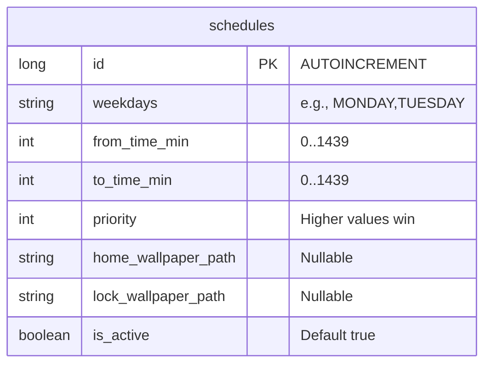
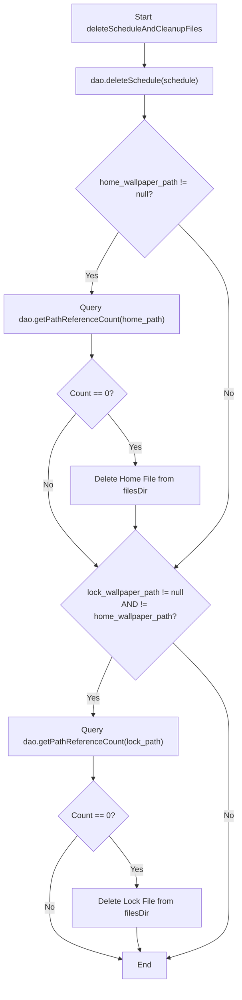
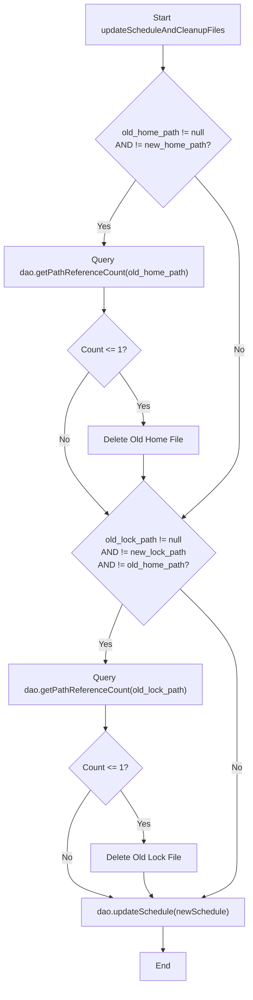

# Database & Storage Design Specification: Scheduled Custom Wallpaper Application

## 1. Overview
This document specifies the persistence and file storage architecture for the Wallpaper Scheduler application. To implement a reliable, duration-based wallpaper schedule with independent **Home screen** and **Lock screen** configurations, the application decouples database configurations from high-performance bitmap storage.

The storage layer consists of two main components:
1. **Room Database**: SQLite object-mapping library used to store the schedules' configuration metadata, timing constraints, day of week triggers, priority orders, and file path references. It acts as the single source of truth for the background evaluation engine.
2. **Sandbox Filesystem Directory (`filesDir`)**: The application's internal private storage directory (`/data/user/0/com.example.customwallpaper/files/`). To avoid standard database performance degradation, high-resolution wallpaper images are never stored as database BLOBs. Instead, they are processed upfront ("baked" to match device screen dimension requirements, cropped, and compressed to high-quality JPEGs) and stored within this sandbox. The database rows merely point to these local files via absolute paths.

---

## 2. Room Database Schema
The schedules are represented by a single table named `schedules` in the Room Database.

### Database Columns Spec
Below is the structural layout of the `schedules` table, detailing data types, nullability, constraints, and operational purposes:

| Column Name | SQLite Type | Room/Kotlin Type | Nullability | Constraints | Description |
| :--- | :--- | :--- | :--- | :--- | :--- |
| `id` | `INTEGER` | `Long` | `NOT NULL` | Primary Key, `autoGenerate = true` | The unique identifier auto-incremented by SQLite. Used as a deterministic tie-breaker for schedules of equal priority and start time. |
| `weekdays` | `TEXT` | `String` | `NOT NULL` | None | Comma-separated uppercase day names (e.g., `"MONDAY,TUESDAY,FRIDAY"`) indicating on which days this schedule rule triggers. |
| `from_time_min` | `INTEGER` | `Int` | `NOT NULL` | `CHECK (from_time_min >= 0 AND from_time_min < 1440)` | The starting time represented as minutes from midnight (0 to 1439). |
| `to_time_min` | `INTEGER` | `Int` | `NOT NULL` | `CHECK (to_time_min >= 0 AND to_time_min < 1440)` | The ending time represented as minutes from midnight (0 to 1439). Overnight ranges are supported (where `from_time_min` > `to_time_min`). |
| `priority` | `INTEGER` | `Int` | `NOT NULL` | None | Numerical priority value (higher values win) used to resolve overlaps when multiple schedule durations are simultaneously active. |
| `home_wallpaper_path` | `TEXT` | `String?` | `NULLABLE` | None | Absolute path to the baked JPEG file targeting the Home screen. If `null`, this schedule has no effect on the Home screen wallpaper. |
| `lock_wallpaper_path` | `TEXT` | `String?` | `NULLABLE` | None | Absolute path to the baked JPEG file targeting the Lock screen. If `null`, this schedule has no effect on the Lock screen wallpaper. |
| `is_active` | `INTEGER` | `Boolean` | `NOT NULL` | Default `1` (true) | Boolean flag (stored as 0/1 in SQLite) to enable/disable the schedule toggle via the Settings List UI. |

### Mermaid ER Diagram
The database table layout is represented in the entity-relationship model below:



### Prospective Kotlin Implementation
The corresponding Kotlin classes represent the Room Entity structure and the Database Access Object (DAO) queries:

#### Entity Definition
<!-- file: app/src/main/java/com/example/customwallpaper/wallpaperscheduler/data/WallpaperSchedule.kt -->
```kotlin
package com.example.customwallpaper.wallpaperscheduler.data

import androidx.room.ColumnInfo
import androidx.room.Entity
import androidx.room.PrimaryKey

@Entity(tableName = "schedules")
data class WallpaperSchedule(
    @PrimaryKey(autoGenerate = true)
    val id: Long = 0,

    @ColumnInfo(name = "weekdays")
    val weekdays: String,        // e.g. "MONDAY,TUESDAY,FRIDAY"

    @ColumnInfo(name = "from_time_min")
    val fromTimeMin: Int,    // Start time (minutes from midnight: 0-1439)

    @ColumnInfo(name = "to_time_min")
    val toTimeMin: Int,        // End time (minutes from midnight: 0-1439)

    @ColumnInfo(name = "priority")
    val priority: Int,            // Numerical priority (higher values win)

    @ColumnInfo(name = "home_wallpaper_path")
    val homeWallpaperPath: String?,

    @ColumnInfo(name = "lock_wallpaper_path")
    val lockWallpaperPath: String?,

    @ColumnInfo(name = "is_active")
    val isActive: Boolean = true
)
```

#### DAO Definition
<!-- file: app/src/main/java/com/example/customwallpaper/wallpaperscheduler/data/ScheduleDao.kt -->
```kotlin
package com.example.customwallpaper.wallpaperscheduler.data

import androidx.room.Dao
import androidx.room.Delete
import androidx.room.Insert
import androidx.room.OnConflictStrategy
import androidx.room.Query
import androidx.room.Update

@Dao
interface ScheduleDao {
    @Query("SELECT * FROM schedules WHERE is_active = 1")
    suspend fun getActiveSchedules(): List<WallpaperSchedule>

    @Query("SELECT * FROM schedules")
    suspend fun getAllSchedules(): List<WallpaperSchedule>

    @Insert(onConflict = OnConflictStrategy.REPLACE)
    suspend fun insertSchedule(schedule: WallpaperSchedule): Long

    @Update
    suspend fun updateSchedule(schedule: WallpaperSchedule)

    @Delete
    suspend fun deleteSchedule(schedule: WallpaperSchedule)

    @Query("""
        SELECT COUNT(*) FROM schedules
        WHERE home_wallpaper_path = :path OR lock_wallpaper_path = :path
    """)
    suspend fun getPathReferenceCount(path: String): Int
}
```

---

## 3. Filesystem Directory Map
The baked wallpaper assets reside strictly within the private local directory mapped to the application's package context.

### ASCII Sandbox Layout
The internal private sandbox (`/data/user/0/com.example.customwallpaper/files/`) is structured as follows:

```
/data/user/0/com.example.customwallpaper/
├── cache/                            # Temporary caches (Coil, etc.)
└── files/                            # Sandbox directory (context.filesDir)
    ├── baked_wp_1719934800000.jpg    # Home Screen baked image (isolated path)
    ├── baked_wp_1719935100000.jpg    # Lock Screen baked image (isolated path)
    └── baked_wp_1719935400000.jpg    # Shared image referenced by both home & lock
```

### File Naming Convention
To prevent directory conflicts and ensure deterministic output creation, all baked images must be named according to the following template:
`baked_wp_[timestamp].jpg`
* `[timestamp]`: The Unix millisecond epoch timestamp representing the exact moment the bitmap rendering pipeline completed baking the crop. E.g., `baked_wp_1719934800000.jpg`.

### Shared-Path Strategy
When a user configures a schedule targeting **Both** screens:
1. The media rendering pipeline processes and crops the source image **only once**.
2. It writes the compressed bitmap to a single file inside the sandbox.
3. The resulting absolute filepath string is assigned to **both** the `home_wallpaper_path` and `lock_wallpaper_path` columns of that schedule's row.
4. **Impact on Reference-Counting**: In this state, a single file has a reference count of 2 within that single row. When cleanups occur, the cleanup logic must account for this shared path so it does not issue dual-delete calls or delete a file that is still referenced by the other screen column of the same row.

---

## 4. Reference-Counted File Cleanup Flow
To prevent orphaned images from occupying flash memory indefinitely, the application employs a reference-counting protocol. File resources are unlinked only when no schedules reference them.

### Single Schedule Deletion (`deleteScheduleAndCleanupFiles`)
When a schedule is removed, the DB row is first deleted. We then inspect the deleted record's paths, check their reference counts, and unlink them from disk if the count reaches zero.

#### Flow Diagram


#### Prospective Implementation
```kotlin
suspend fun deleteScheduleAndCleanupFiles(
    context: Context,
    dao: ScheduleDao,
    schedule: WallpaperSchedule
) {
    // Delete the schedule row from SQLite database
    dao.deleteSchedule(schedule)

    // Check references for the home wallpaper path
    schedule.homeWallpaperPath?.let { path ->
        val refs = dao.getPathReferenceCount(path)
        if (refs == 0) {
            val file = File(path)
            if (file.exists()) {
                file.delete()
            }
        }
    }

    // Check references for the lock wallpaper path (if different from home)
    schedule.lockWallpaperPath?.let { path ->
        if (path != schedule.homeWallpaperPath) {
            val refs = dao.getPathReferenceCount(path)
            if (refs == 0) {
                val file = File(path)
                if (file.exists()) {
                    file.delete()
                }
            }
        }
    }
}
```

### Single Schedule Update (`updateScheduleAndCleanupFiles`)
When updating a schedule's paths, we must execute the reference-counted file cleanup routine for the old file paths **BEFORE** updating the record in the database.

> [!IMPORTANT]
> **Delete-Before-Write Logic Constraint:** If the database write is committed first, the reference count of the old files drops to zero, but the app loses the target path strings (overwritten in DB). This leads to untrackable file storage leaks if the cleanup script fails mid-operation. By querying and clean-deleting files *before* committing the write, the app keeps a handle on the exact path strings. If the reference count is $\le 1$ (meaning the current schedule record is the sole referencer), the file is safely deleted from disk, followed by the database commit.

#### Flow Diagram


#### Prospective Implementation
```kotlin
suspend fun updateScheduleAndCleanupFiles(
    context: Context,
    dao: ScheduleDao,
    oldSchedule: WallpaperSchedule,
    newSchedule: WallpaperSchedule
) {
    // 1. Clean up old home wallpaper if changed and no longer referenced
    oldSchedule.homeWallpaperPath?.let { oldPath ->
        if (oldPath != newSchedule.homeWallpaperPath) {
            val refs = dao.getPathReferenceCount(oldPath)
            // If the only reference is the current schedule being updated, refs will be 1
            if (refs <= 1) {
                val file = File(oldPath)
                if (file.exists()) {
                    file.delete()
                }
            }
        }
    }

    // 2. Clean up old lock wallpaper if changed and no longer referenced (and not same as home)
    oldSchedule.lockWallpaperPath?.let { oldPath ->
        if (oldPath != newSchedule.lockWallpaperPath && oldPath != oldSchedule.homeWallpaperPath) {
            val refs = dao.getPathReferenceCount(oldPath)
            if (refs <= 1) {
                val file = File(oldPath)
                if (file.exists()) {
                    file.delete()
                }
            }
        }
    }

    // 3. Persist the updated schedule to the database
    dao.updateSchedule(newSchedule)
}
```

### Batch Deletion Logic
If the user selects multiple schedules for batch deletion, executing the single deletion routine sequentially inside a loop yields $O(N)$ database queries and redundant transactions.

To perform a safe, highly performant batch deletion:
1. **Identify Candidates**: Collect all unique, non-null file paths referenced across all selected schedules' `home_wallpaper_path` and `lock_wallpaper_path` columns into a set ($P_{candidate}$).
2. **Execute DB Deletion**: Delete all selected schedule rows in a single database transaction (e.g. `dao.deleteSchedules(schedulesList)`).
3. **Reference Verification**: Iterate through the paths in $P_{candidate}$ and query `dao.getPathReferenceCount(path)`.
4. **Unlinking**: If the count returns `0` (indicating no other active schedule in the database uses this file), delete the file from the filesystem.

This transaction-first execution model guarantees that if multiple schedules targeting the same shared baked file are deleted at the same time, the file is unlinked only once and is not orphaned.

---

## 5. Testing & Observability Recommendations

### Telemetry Logs (Logcat)
To simplify debugging of the database and background rendering engines, configure structured Logcat outputs at key execution boundaries:

* **Database Operations**:
  * **Insert**: `Log.d("WallpaperDB", "Insert: ID=$id, active=$isActive, weekdays=$weekdays, times=$fromTimeMin-$toTimeMin, home=$homeWallpaperPath, lock=$lockWallpaperPath")`
  * **Update**: `Log.d("WallpaperDB", "Update: ID=$id, oldHome=$oldHomePath, newHome=$newHomePath, oldLock=$oldLockPath, newLock=$newLockPath")`
  * **Delete**: `Log.d("WallpaperDB", "Delete: ID=$id")`
* **Filesystem Operations**:
  * **Bake Pipeline**: `Log.d("WallpaperStorage", "Baking complete: saved $filePath from $sourceUri. Parameters: scale=$scale, offsetX=$offsetX, offsetY=$offsetY")`
  * **File Cleanup**: `Log.d("WallpaperStorage", "File unlinked: deleted $filePath (Reason: Ref count is 0)")`
  * **File Retained**: `Log.d("WallpaperStorage", "File retained: $filePath (Reason: Ref count is $count)")`
* **Evaluator & Cache**:
  * **Evaluation Trigger**: `Log.d("WallpaperEvaluator", "Evaluation run: CurrentTime=min:$currentMin, day=$currentDay")`
  * **Evaluation Match**: `Log.d("WallpaperEvaluator", "Match found: HomeScheduleId=$homeId, LockScheduleId=$lockId")`
  * **Cache Skip**: `Log.d("WallpaperEvaluator", "Apply skipped: Target IDs match cached IDs (Home=$homeId, Lock=$lockId). No filesystem read required.")`

### Unit Testing Strategies
Use standard Room Testing support to isolate DAO and cleanup tests from the physical storage of a test device.

1. **In-Memory Database Testing**:
   Initialize the database using an in-memory builder in the test setup stage:
   ```kotlin
   @Before
   fun createDb() {
       val context = ApplicationProvider.getApplicationContext<Context>()
       db = Room.inMemoryDatabaseBuilder(context, WallpaperDatabase::class.java)
           .allowMainThreadQueries() // Acceptable for unit testing
           .build()
       dao = db.scheduleDao()
   }
   ```
   * *Benefits*: Because the database structure resides solely in volatile system RAM, tests execute quickly, start from a clean state every run, and leave no persistent files or configuration artifacts on test runners.

2. **Crucial Cleanup Test Scenarios**:
   * **Test Scenario 1: Isolated Deletion**
     Insert a schedule pointing to a mock file in `filesDir`. Delete the schedule. Verify that `dao.getPathReferenceCount(...)` returns `0` and the mock file is deleted from the filesystem.
   * **Test Scenario 2: Shared Resource Deletion**
     Insert Schedule A and Schedule B pointing to the exact same home wallpaper path. Delete Schedule A. Verify that the mock file **still exists** (reference count should be 1). Delete Schedule B. Verify that the mock file is now successfully deleted.
   * **Test Scenario 3: Update Cleanup Path**
     Insert a schedule with `home_wallpaper_path = path1`. Update it to `path2`. Verify that `path1` is deleted from disk and `path2` remains present.
   * **Test Scenario 4: Shared-Path Target (Both Screens)**
     Insert a single schedule targeting "Both" screens (`home_wallpaper_path = path1` and `lock_wallpaper_path = path1`). Check reference count (should be 2). Delete the schedule. Verify the mock file is deleted and no duplicate file deletions crash the process.
   * **Test Scenario 5: Batch Deletion Isolation**
     Insert three schedules sharing overlapping file resources. Run the batch deletion routine on two of them. Assert that only the files with a post-transaction reference count of 0 are unlinked.
