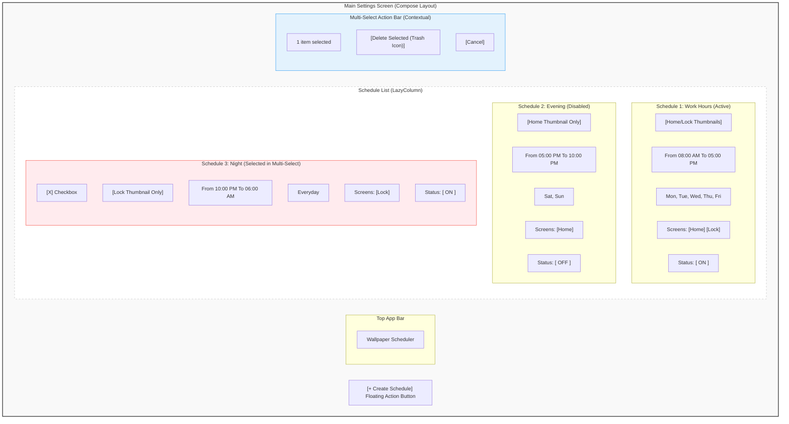
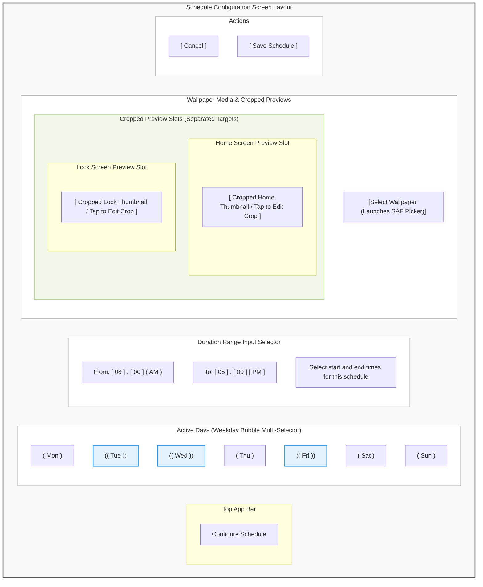
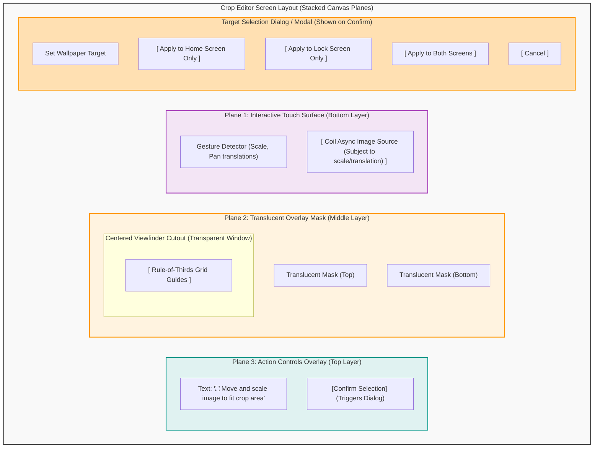
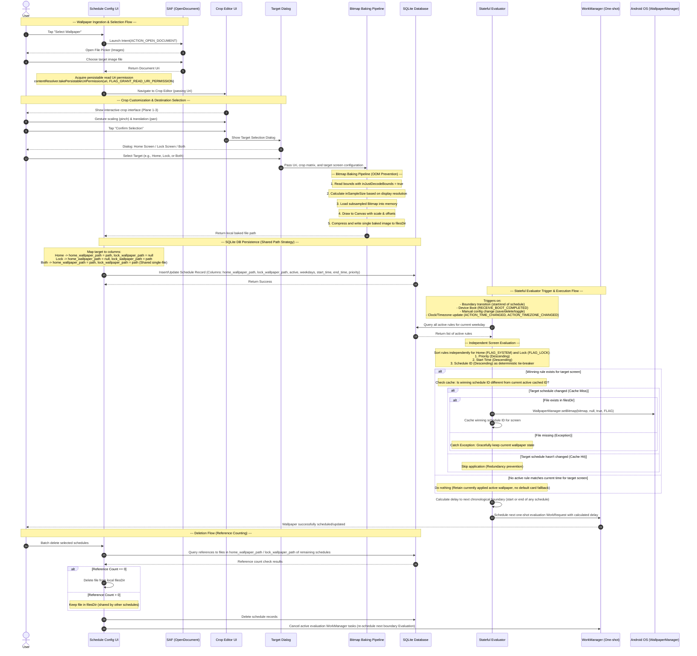

# Wireframe & User Flow Specification: Scheduled Custom Wallpaper Application

## Overview
This document specifies the updated user interface layouts, interactive wireframes, and sequence flow for the duration-based scheduling model of the Wallpaper Scheduler application. The design introduces separation between the **Home screen** and **Lock screen** wallpaper targets, moving away from simple time-based switches to time-duration scheduling with priority resolution and resource-efficient local file management.

---

## UI Components & Wireframes

### 1. Main Settings Screen
The Main Settings Screen displays the scheduled wallpaper rules and their active states. This screen does not present any "default wallpaper" cards or configurations; instead, the active system/lock screen wallpapers are retained if no scheduled rule is currently active.
- **Schedules List:** Renders active/inactive status toggles, target times (duration range `From` and `To`), target screen tags (Home, Lock, or Both), and cropped previews.
- **Multi-Select & Batch Deletion:** Initiated via a long-press on any schedule item, revealing selection checkboxes next to items and a contextual action bar displaying selection count and a trash icon for bulk deletion.

#### Diagram: Main Settings Screen Layout

---

### 2. Schedule Configuration Screen
Allows users to create or edit a schedule.
- **Active Days Selector:** Weekday multi-select bubbles (Mon-Sun) allowing toggling specific days of the week.
- **Duration Range Input:** Explicit `From` (start) and `To` (end) time range inputs.
- **Dual Screen Previews:** Separate preview thumbnail slots for both Home screen and Lock screen, indicating what image is currently selected/cropped for each.

#### Diagram: Schedule Configuration Screen Layout

---

### 3. Crop Editor Screen
The Crop Editor enables precise zoom, pan, and crop scaling before final rendering.
- **Three Stacked Planes Layout:**
  - **Plane 1 (Bottom):** Coil-rendered raw source image responding to scaling and translation gestures.
  - **Plane 2 (Middle):** Translucent backdrop mask with a centered aspect-ratio grid viewfinder.
  - **Plane 3 (Top):** Action headers and confirmation buttons.
- **Target Selection Dialog/Modal:** Triggered on confirmation, presenting the user with options to set the cropped image destination: "Apply to Home Screen Only", "Apply to Lock Screen Only", or "Apply to Both".

#### Diagram: Crop Editor Stacked Planes Layout

---

## System & User Flow Sequence Diagram

The diagram below details the end-to-end execution flow of the application. It includes user-driven wallpaper selection via the Android Storage Access Framework (SAF), permission persistence, the high-performance bitmap baking pipeline, database persistence, stateful evaluation, and reference-counted cleanup.

---

## Design Decisions & Trade-offs

### 1. Single-File / Dual-Column DB Sharing Strategy
To prevent redundant storage utilization, when a user creates a schedule targeting "Both" screens, the application bakes only a **single bitmap file** and saves it under `filesDir`.
- **Database Schema Implementation:** The schedule table contains separate fields for `home_wallpaper_path` and `lock_wallpaper_path`.
- **Reference Management:** If "Both" is selected, both columns store the exact same local file path (e.g. `/data/user/0/com.example/files/wp_12345.jpg`). This avoids storing duplicate image copies on disk while preserving database query simplicity.
- **Reference-Counted Deletion:** When a schedule is deleted or updated, a query counts how many other records reference that specific file path. The file is only unlinked from `filesDir` when its reference count drops to 0.

### 2. Stateful Engine and Persistent Unoccupied Time Slots
Unlike standard scheduler implementations that rely on an "app-level default wallpaper" to occupy inactive time ranges, this engine follows a passive retention policy:
- **No App-Level Defaults:** When no schedule rule is active for a given screen, the evaluation engine performs a **no-op**, allowing whatever wallpaper is currently active on the device to persist.
- **Stateful Resolution:** The evaluator queries the database and filters schedules by active status, matching weekdays, and time duration coverage (`currentTime` falls between `start_time` and `end_time`).
- **State Preservation:** By executing a no-op, the system accommodates manual wallpaper updates made by the user outside the app, as the app will not override a user's active wallpaper unless a scheduled event explicitly triggers a change.

### 3. Timezone Drift and System Clock Listener Registration
Time shifts, timezone changes, and manual system clock modifications can lead to scheduling discrepancies or skipped triggers.
- **Event Listeners:** The application registers a system broadcast receiver for `Intent.ACTION_TIME_CHANGED` and `Intent.ACTION_TIMEZONE_CHANGED`, as well as `Intent.ACTION_BOOT_COMPLETED`.
- **Immediate Re-evaluation:** Upon receiving any of these broadcasts, the stateful evaluator runs immediately to determine which wallpaper should be active under the new time frame, updates the cached state if needed, and recalculates/re-queues the WorkManager execution queue.

### 4. Deterministic Rule Overlap Resolution & Redundancy Prevention
When multiple schedules overlap in time coverage, the application resolves conflicts deterministically:
- **Multi-Level Sort Order:** For each screen target, rules are queried and sorted in descending order by:
  1. `priority` (user-defined priority value)
  2. `start_time` (most recently started duration wins)
  3. `id` (database primary key acts as a deterministic tie-breaker)
- **Redundancy & Caching:** To avoid wasting battery and memory applying the same wallpaper repeatedly, the engine caches the winning `schedule_id` for both the Home and Lock screens. If the evaluator runs and the winning schedule matches the cache, the application step is bypassed.
- **Safety Handling:** If a file is deleted from disk (e.g. by clean-up tools), the `WallpaperManager` execution block catches file-not-found exceptions gracefully, preventing crashes and keeping the current active wallpaper.

---

## Open Questions / Areas for Further Research
- <!-- TODO: Investigate behavior of takePersistableUriPermission when the source file is deleted or modified by an external gallery app. -->
- <!-- TODO: Profile battery usage of WorkManager one-shot triggers when system time is adjusted frequently. -->
- <!-- TODO: Verify fallback behavior on older API versions if FLAG_LOCK is not fully isolated by the vendor OEM. -->

---

## References
- [TECHNICAL_SPECIFICATION.md](file:///home/philong/wallpaper-scheduler/TECHNICAL_SPECIFICATION.md) — Technical blueprint for Jetpack Compose dual-plane viewport canvas, media rendering pipeline, and background scheduling engine.
