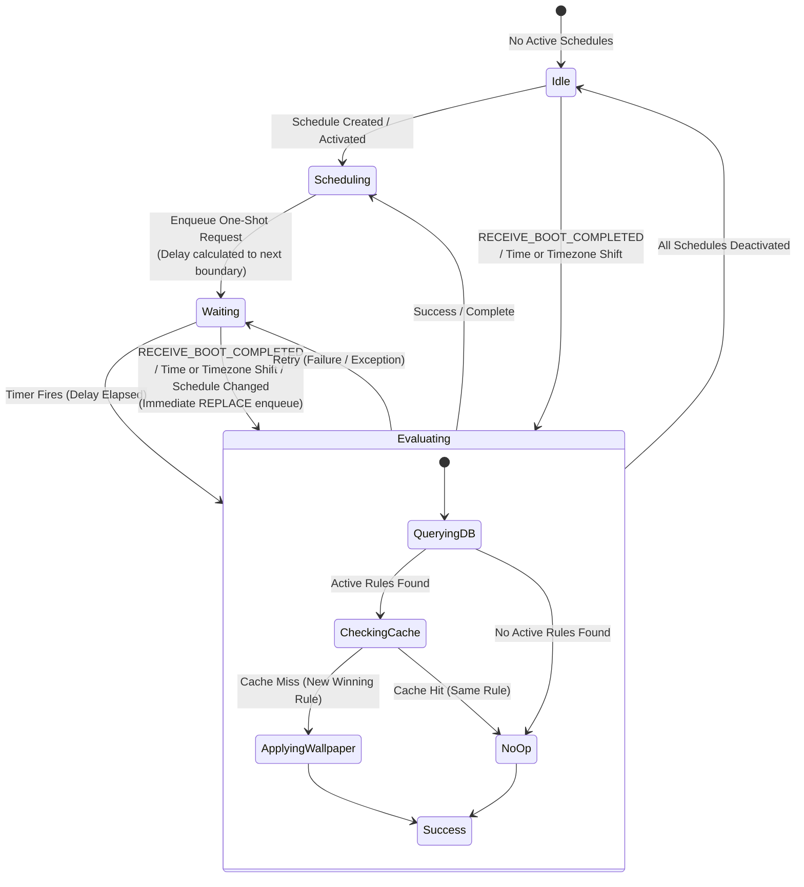
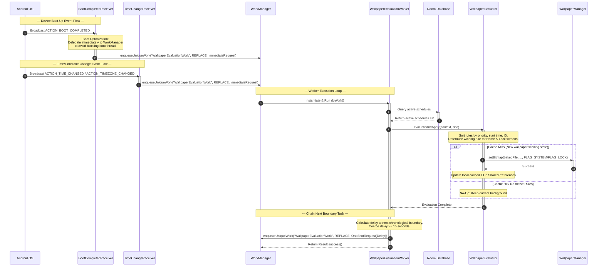

# WorkManager & Broadcast Lifecycle Design: Scheduled Custom Wallpaper Application

## 1. Overview
This document specifies the background scheduling architecture and broadcast receiver lifecycle for the Scheduled Custom Wallpaper application. To achieve reliable wallpaper updates without draining system resources, the application utilizes a **One-Shot WorkRequest Chaining** pattern managed by Android Jetpack WorkManager instead of maintaining a resident background service.

### Resident Background Service vs. Chained One-Shot WorkRequests

A persistent background service is highly discouraged on modern Android systems for several architectural and efficiency reasons:
- **Battery Conservation:** Maintaining a resident service requires keeping the device's CPU awake (via Wakelocks) or repeatedly running background threads, which degrades battery life. WorkManager integrates directly with the OS scheduler, allowing the system to run tasks during window alignments (e.g., when the device is awake or plugged in) and sleep completely in the intervals.
- **Memory Efficiency:** A resident service constantly consumes RAM. Modern Android operating systems aggressively terminate inactive apps to reclaim memory. By using ephemeral workers, the application's process is launched only to perform calculations and apply updates. Once complete, the process terminates or scales down, reducing its active memory footprint to zero.
- **System Constraints (Oreo / API 26+ Limits):** Starting with Android 8.0 (API 26), background execution is heavily restricted. Initiating a standard background service from the background throws a `ForegroundServiceStartNotAllowedException` in Android 12+. To bypass this with a foreground service, the app must show a persistent notification, which is intrusive for a wallpaper utility. WorkManager abstractly manages these restrictions, executing tasks using JobScheduler or background workers under the hood.

---

## 2. WorkManager Execution Loop
The execution loop is managed by `WallpaperEvaluationWorker`, a subclass of `CoroutineWorker`. This class runs asynchronously on a background thread and performs stateful evaluation before chaining the next boundary transition.

### Step-by-Step Execution Sequence

1. **Initialization:**
   Upon trigger, the system instantiates `WallpaperEvaluationWorker.doWork()`, passing the system context and parameters. It obtains the application's `WallpaperDatabase` instance and retrieves the `ScheduleDao`.
2. **Stateful Evaluation (`WallpaperEvaluator.evaluateAndApply`):**
   - **Query Active Rules:** The worker fetches all active schedules (`is_active = 1`) from the Room Database.
   - **Determine Current Time:** The worker fetches the current time, calculating the day of the week and minutes from midnight ($0$ to $1439$). It also determines yesterday's weekday to evaluate overnight rules.
   - **Resolve Target Wallpaper:** Active schedules are filtered to check if their timing matches the current window (handling standard and overnight spans). The engine then resolves the winning wallpaper path independently for the Home screen (`FLAG_SYSTEM`) and Lock screen (`FLAG_LOCK`):
     1. Sort by `priority` descending (highest priority wins).
     2. Sort by `from_time_min` descending (most recently started wins).
     3. Sort by schedule `id` descending (deterministic database primary key tie-breaker).
3. **Cache Validation & Redundancy Prevention:**
   - The evaluator fetches the active schedule IDs applied to the Home and Lock screens from Shared Preferences.
   - If the winning schedule ID matches the cached ID (cache hit), the worker skips the filesystem read and bitmap application, preventing unnecessary disk I/O and CPU cycles.
   - If a new schedule ID wins (cache miss), the evaluator verifies the file's existence in the app's internal sandbox (`filesDir`).
4. **Applying Wallpaper:**
   - If the file exists, it is decoded into a `Bitmap` using `BitmapFactory.decodeFile()`.
   - The bitmap is set on the device using `WallpaperManager.getInstance(context).setBitmap(bitmap, null, true, flag)`.
   - The bitmap is immediately recycled to release memory.
   - The new winning schedule ID is written to SharedPreferences.
   - If no active schedule matches the current time, the engine executes a **no-op**, allowing the current background to persist.
5. **Chain next worker (`scheduleNextEvaluation`):**
   - The worker invokes the boundary calculation helper to determine the time remaining until the next scheduled boundary.
   - It schedules the next one-shot `WorkRequest` with the calculated initial delay.
6. **Completion:**
   - Returns `Result.success()`. If a database transaction fails or a transient filesystem error is encountered, the task returns `Result.retry()`.

---

## 3. Boundary Calculation Algorithm
The boundary calculation determines the delay (in milliseconds) from the current time to the next chronological state change (either the start or end of a scheduled window) among all active rules.

### Transition Boundary Logic
Let $T_{current}$ be the current time represented as milliseconds from midnight today:
$$T_{current} = \left((Hour \times 60 + Minute) \times 60 + Second\right) \times 1000$$

For each active schedule, there are two boundary times:
- Start Boundary ($T_{start}$): `fromTimeMin * 60 * 1000L`
- End Boundary ($T_{end}$): `toTimeMin * 60 * 1000L`

For each boundary, the remaining time ($\Delta t$) is calculated:
$$\Delta t = T_{boundary} - T_{current}$$

If $\Delta t \le 0$, the boundary event has already occurred today. The engine projectively maps this boundary to tomorrow by adding a 24-hour cycle:
$$\Delta t = \Delta t + (24 \times 60 \times 60 \times 1000)$$

The engine compares all calculated values of $\Delta t$ across all active schedules and selects the minimum positive delay:
$$\text{minDelayMs} = \min(\Delta t_1, \Delta t_2, \dots, \Delta t_n)$$

### Coercion Guardrail
To prevent a rapid rescheduling loop (such as when the worker triggers at 07:59:59 and schedules the next run for 1 second later at 08:00:00, or due to slight system clock drift), a safety limit of **15 seconds** is enforced using Kotlin's coercion function:
$$\text{finalDelayMs} = \max(\text{minDelayMs}, 15000\text{ ms})$$

### Overnight Schedule Handling
An overnight schedule is defined by a duration where the start time is greater than the end time ($T_{start} > T_{end}$), spanning across midnight.
During evaluation:
- The rule is considered active today if the current day matches the schedule's active days and the current time is $\ge T_{start}$.
- The rule is also considered active today if yesterday matches the schedule's active days and the current time is $\le T_{end}$.
This logic allows the boundary transition algorithm to treat the overnight boundaries as distinct temporal marks, ensuring schedules crossing midnight trigger correctly at their end times.

### Code: Boundary Delay Calculation & Scheduling
<!-- file: app/src/main/java/com/example/customwallpaper/worker/WallpaperSchedulerHelper.kt -->
```kotlin
package com.example.customwallpaper.worker

import android.content.Context
import androidx.work.ExistingWorkPolicy
import androidx.work.OneTimeWorkRequestBuilder
import androidx.work.WorkManager
import com.example.customwallpaper.wallpaperscheduler.data.WallpaperSchedule
import java.util.Calendar
import java.util.concurrent.TimeUnit

object WallpaperSchedulerHelper {
    
    private const val WORK_NAME = "WallpaperEvaluationWork"

    /**
     * Finds the closest future boundary time among all active schedules, calculates
     * the delay in milliseconds, and enqueues a delayed one-shot WorkRequest.
     */
    fun scheduleNextEvaluation(context: Context, activeSchedules: List<WallpaperSchedule>) {
        if (activeSchedules.isEmpty()) {
            WorkManager.getInstance(context).cancelUniqueWork(WORK_NAME)
            return
        }

        val calendar = Calendar.getInstance()
        val currentHour = calendar.get(Calendar.HOUR_OF_DAY)
        val currentMinute = calendar.get(Calendar.MINUTE)
        val currentSecond = calendar.get(Calendar.SECOND)
        val currentTimeMs = ((currentHour * 60 + currentMinute) * 60 + currentSecond) * 1000L

        var minDelayMs = Long.MAX_VALUE

        // Iterate through all active schedules to find the closest transition boundary
        for (schedule in activeSchedules) {
            val startMs = schedule.fromTimeMin * 60 * 1000L
            val endMs = schedule.toTimeMin * 60 * 1000L

            // Evaluate both start and end boundaries
            for (boundaryMs in listOf(startMs, endMs)) {
                var diff = boundaryMs - currentTimeMs
                if (diff <= 0) {
                    // Boundary has passed today; reschedule it for tomorrow
                    diff += 24 * 60 * 60 * 1000L
                }
                if (diff < minDelayMs) {
                    minDelayMs = diff
                }
            }
        }

        // Coerce delay to a minimum of 15 seconds to prevent rapid rescheduling loops
        val finalDelayMs = minDelayMs.coerceAtLeast(15000L)

        val oneShotRequest = OneTimeWorkRequestBuilder<WallpaperEvaluationWorker>()
            .setInitialDelay(finalDelayMs, TimeUnit.MILLISECONDS)
            .build()

        WorkManager.getInstance(context).enqueueUniqueWork(
            WORK_NAME,
            ExistingWorkPolicy.REPLACE,
            oneShotRequest
        )
    }
}
```

---

## 4. Broadcast Receivers & Registration Map
To maintain scheduling synchronization across device restarts and clock corrections, the application implements broadcast receivers.

### Broadcast Receiver Mapping

| Broadcast Action | Receiver Class | Registration Method | Purpose / Implementation Constraint |
| :--- | :--- | :--- | :--- |
| `Intent.ACTION_BOOT_COMPLETED`<br/>`"android.intent.action.BOOT_COMPLETED"` | `BootCompletedReceiver` | **Static Manifest** (`AndroidManifest.xml`) | Triggers immediately when the device finishes booting up to reschedule the wallpaper schedule. **Boot Optimization:** Under high CPU contention at boot, the receiver runs on a main thread binder. It must execute instantly. Instead of querying the database or applying backgrounds inside `onReceive()`, the receiver enqueues an immediate, one-shot evaluation request to WorkManager. This releases the binder immediately, allowing WorkManager to manage CPU contention gracefully in the background. |
| `Intent.ACTION_TIME_CHANGED`<br/>`"android.intent.action.TIME_SET"` | `TimeChangeReceiver` | **Programmatic Runtime** (Application class registration) | Triggers when the user manually changes the system time. Triggers an immediate re-evaluation to align the active wallpaper with the new time and recalculates future boundaries. **API 26+ Limit:** Broadcast actions for clock shifts cannot be statically declared in the manifest. |
| `Intent.ACTION_TIMEZONE_CHANGED`<br/>`"android.intent.action.TIMEZONE_CHANGED"` | `TimeChangeReceiver` | **Programmatic Runtime** (Application class registration) | Triggers when the device timezone updates. Re-evaluates schedules using the new local time zone conversion, updates backgrounds, and queues the next boundary transition. **API 26+ Limit:** Timezone updates cannot be statically declared in the manifest. |

### Code: Application Registration
<!-- file: app/src/main/java/com/example/customwallpaper/CustomWallpaperApplication.kt -->
```kotlin
package com.example.customwallpaper

import android.app.Application
import android.content.Intent
import android.content.IntentFilter
import com.example.customwallpaper.receiver.TimeChangeReceiver

class CustomWallpaperApplication : Application() {
    private lateinit var timeChangeReceiver: TimeChangeReceiver

    override fun onCreate() {
        super.onCreate()
        
        // Register TimeChangeReceiver programmatically to comply with API 26+ restrictions
        timeChangeReceiver = TimeChangeReceiver()
        val intentFilter = IntentFilter().apply {
            addAction(Intent.ACTION_TIME_CHANGED)
            addAction(Intent.ACTION_TIMEZONE_CHANGED)
        }
        registerReceiver(timeChangeReceiver, intentFilter)
    }
}
```

---

## 5. Mermaid Diagrams

### State Machine Diagram: Scheduler Execution
The state machine below describes the background scheduler's states and transitions:



### Sequence Diagram: System Broadcasts & Re-queuing
The diagram below details the sequence of events when system broadcasts (boot-up, timezone/clock shift) trigger evaluation and re-queuing:



---

## 6. Testing Strategies

Testing asynchronous, boundary-triggered workers can be complex. To verify schedule transitions, the app utilizes `androidx.work.testing` to execute workers synchronously in a controlled unit test environment.

### Test Environment Setup
- **WorkManagerTestInitHelper:** Configures a test implementation of `WorkManager` that delegates execution to test threads under programmatic control instead of using the OS JobScheduler.
- **TestListenableWorkerBuilder:** Instantiates the CoroutineWorker under a mock system context, bypassing the standard WorkManager enqueue constraints.

### Code: Synchronous Worker Integration Test
<!-- file: app/src/test/java/com/example/customwallpaper/worker/WallpaperEvaluationWorkerTest.kt -->
```kotlin
package com.example.customwallpaper.worker

import android.content.Context
import androidx.room.Room
import androidx.test.core.app.ApplicationProvider
import androidx.work.ListenableWorker
import androidx.work.testing.TestListenableWorkerBuilder
import androidx.work.testing.WorkManagerTestInitHelper
import com.example.customwallpaper.wallpaperscheduler.data.ScheduleDao
import com.example.customwallpaper.wallpaperscheduler.data.WallpaperDatabase
import com.example.customwallpaper.wallpaperscheduler.data.WallpaperSchedule
import kotlinx.coroutines.runBlocking
import org.junit.After
import org.junit.Assert.assertEquals
import org.junit.Before
import org.junit.Test
import org.junit.runner.RunWith
import org.robolectric.RobolectricTestRunner
import java.io.File

@RunWith(RobolectricTestRunner::class)
class WallpaperEvaluationWorkerTest {

    private lateinit var context: Context
    private lateinit var database: WallpaperDatabase
    private lateinit var dao: ScheduleDao

    @Before
    fun setUp() {
        context = ApplicationProvider.getApplicationContext()
        
        // 1. Initialize WorkManager in test mode
        WorkManagerTestInitHelper.initializeTestWorkManager(context)

        // 2. Initialize an in-memory database to prevent test run state leakage
        database = Room.inMemoryDatabaseBuilder(context, WallpaperDatabase::class.java)
            .allowMainThreadQueries()
            .build()
        dao = database.scheduleDao()
    }

    @After
    fun tearDown() {
        database.close()
    }

    @Test
    fun testEvaluationWorker_RunsSuccessfully() = runBlocking {
        // Setup mock schedule inside in-memory database
        val mockFile = File(context.filesDir, "mock_wallpaper.jpg").apply {
            writeText("dummy-data-to-simulate-baked-file")
        }

        val schedule = WallpaperSchedule(
            id = 1L,
            weekdays = "MONDAY,TUESDAY,WEDNESDAY,THURSDAY,FRIDAY,SATURDAY,SUNDAY",
            fromTimeMin = 480, // 08:00 AM
            toTimeMin = 1020,  // 05:00 PM
            priority = 10,
            homeWallpaperPath = mockFile.absolutePath,
            lockWallpaperPath = null,
            isActive = true
        )
        dao.insertSchedule(schedule)

        // Build worker instance
        val worker = TestListenableWorkerBuilder<WallpaperEvaluationWorker>(context).build()

        // Run worker synchronously in Coroutine Scope
        val result = worker.doWork()

        // Verify that execution completes successfully
        assertEquals(ListenableWorker.Result.success(), result)
        
        // Cleanup mock file
        if (mockFile.exists()) {
            mockFile.delete()
        }
    }
}
```

---

## 7. Open Questions / Areas for Further Research
- <!-- TODO: Investigate battery usage differences when using WorkManager with high frequencies of clock-change broadcasts. -->
- <!-- TODO: Profile memory behavior during BitmapFactory decoding to confirm garbage collection efficiency under low-memory states. -->

---

## References
- [TECHNICAL_SPECIFICATION.md](file:///home/philong/wallpaper-scheduler/TECHNICAL_SPECIFICATION.md) — Main application guidelines on storage, UI, crop engines, and database tables.
- [design/database-storage.md](file:///home/philong/wallpaper-scheduler/design/database-storage.md) — Specifications of the SQLite tables and reference-counted file deletion handlers.
